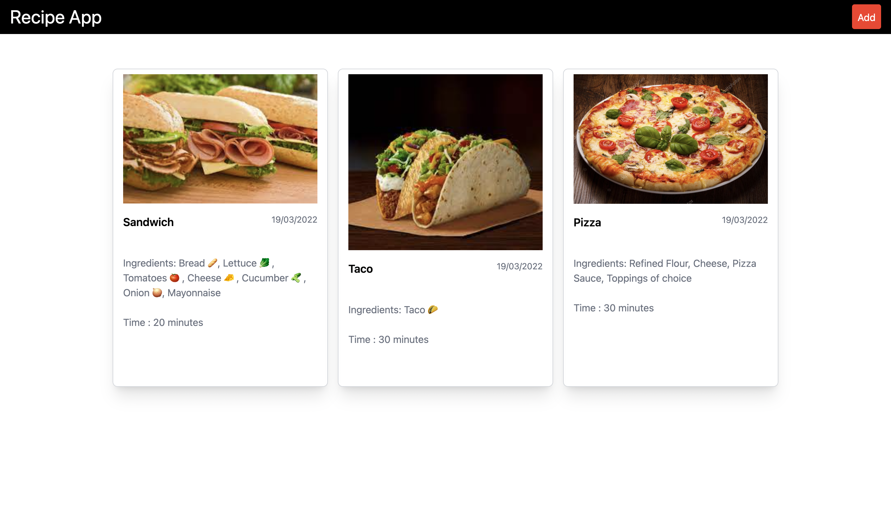
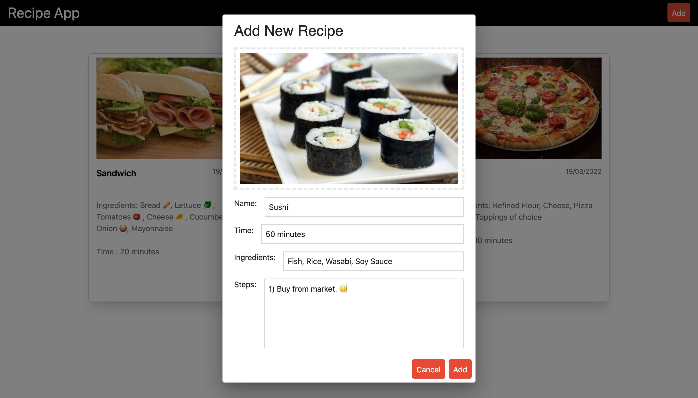
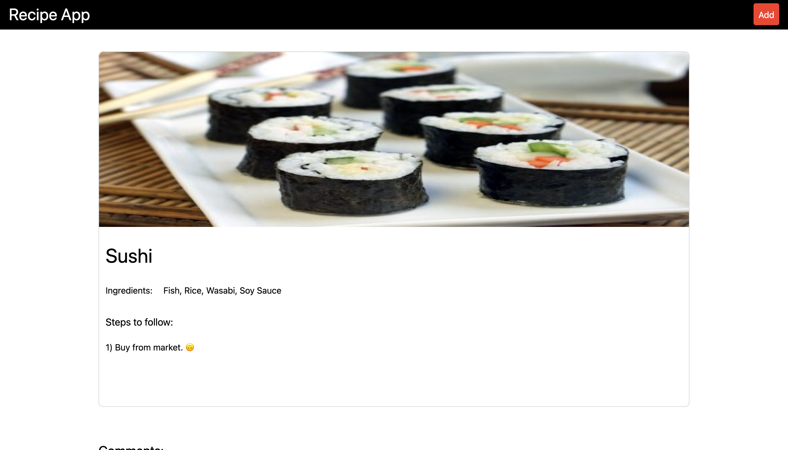
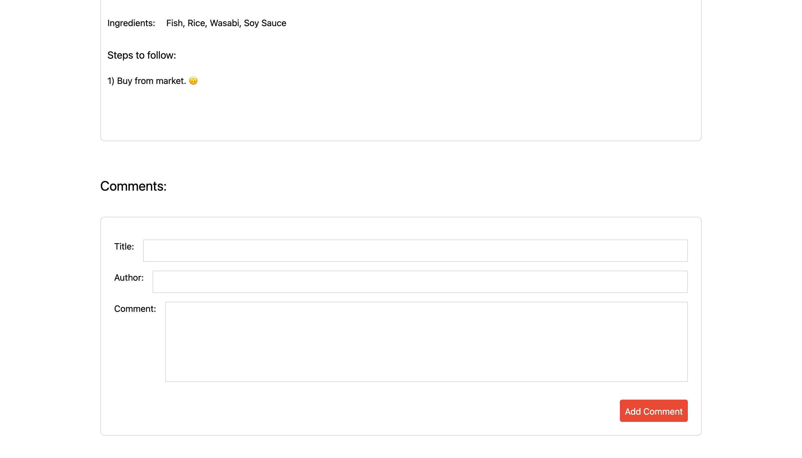
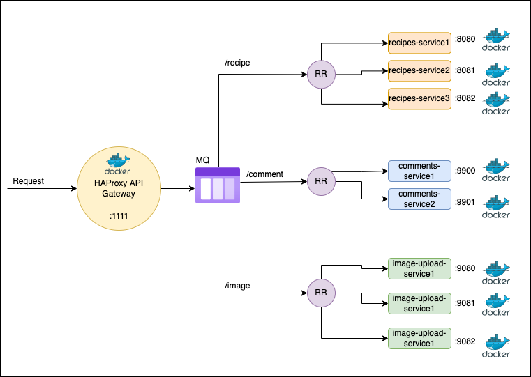
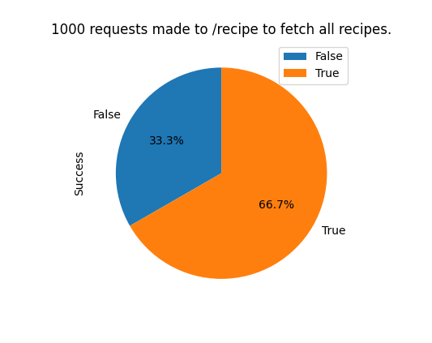
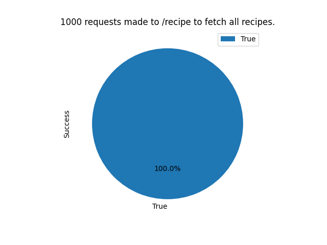
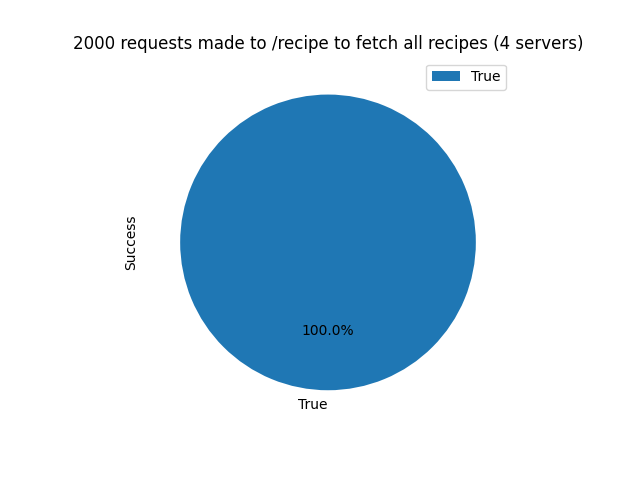
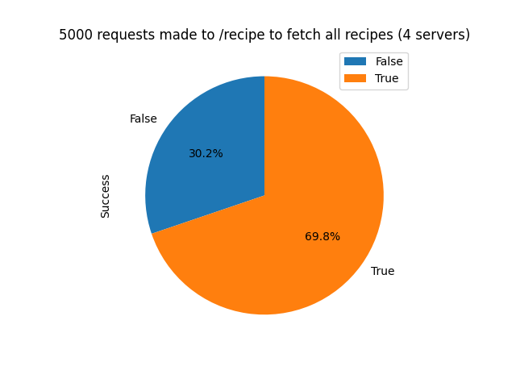

# A basic recipe app built to explore microservices in Node.js

## Frontend

>

- The frontend is built using React and does not consist any fancy stuff.

- The frontend has a dashboard displaying all recipes in card form and a user can add their recipe as well as upload a photo of it using the Add button.

- On clicking a recipe card it displays the ingredients, time taken to prepare the recipe, steps of the recipe.

- Users can add comments to the recipe page by using the add comments form.

>

Dashboard

>

Add Recipe

>

Recipe Page

>

Comments Section

## Backend

>

- There are 3 microservices built using Express (Typescript)

  - Recipes microservice
  - Image Upload microservice
  - Comments microservice

- Recipes microservice contains the routes related to recipes. (All CRUD features)
- Image upload microservice works only to upload images to third party asset hosting service (Cloudinary).
- Comments microservice works only to add comments to specific recipes.
- Each service is containerized using Docker and then orchestrated using Docker Compose.
- HAProxy works as an API gateway and a load balancer that balances multiple instances of each service.

>

Below is the architecture.

- I did not use any message queue but RabbitMQ can be added to queue the requests.

>

## Load testing using JMeter

- I have used JMeter to load test the server with multiple GET requests.
- `/recipe` route is tested.
- Below are the results for multiple loads and changes made to handle the load.

>

### 3 servers

- 1000 requests to API gateway. 3 servers load balanced (Round-Robin) by HAProxy that serve this route.
- In this true signifies successful requests with `200` response and false signifies `503 Service Unavailable` response.

### 4 servers

- 1000 requests to API Gateway.
- 4 servers can handle all 1000 requests successfully.

- 2000 requests to API Gateway.

- 5000 requests to API Gateway.

